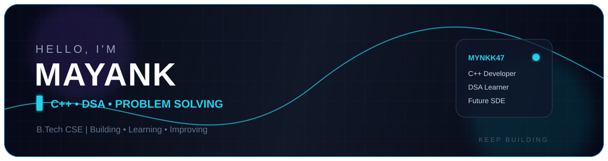

  

---

### 📈 Live Competitive Programming Stats

  
  &nbsp;
  

  
  &nbsp;
  

---

### 👨‍💻 About Me

- 🎓 **Education**: Pursuing B.Tech in Computer Science.
- 🚀 **Focus Areas**: C++, Data Structures & Algorithms, Problem Solving, Competitive Programming and Software Development.
- 💡 **Core Strengths**: C++ fundamentals, Object-Oriented Programming, logical problem solving and algorithmic thinking.
- 🎯 **Current Goals**: Strengthen DSA, improve competitive programming, build meaningful projects, contribute to Open Source and explore Python & AI/ML.
- 💬 **Ask me about**: C++, OOP, beginner DSA, problem solving and programming fundamentals.
- 📫 **Reach me on**: LinkedIn, Codolio, LeetCode, CodeChef and TakeUForward.

---

### 🛠️ Tech Stack & Skills

#### 💻 Programming Languages & Core

  
  
  

#### 🧠 Problem Solving & Learning

  
  
  

#### ⚙️ Developer Tools & Technologies

  
  
  
  

---

### 🎓 Certifications

<table width="100%">
  <tr>
    <td width="50%" valign="top">
      <h4>💻 C++ Certification</h4>
      
Coddy C++ Certificate

      
    </td>
    <td width="50%" valign="top">
      <h4>💻 C++ Certification</h4>
      
Coddy C++ Certificate

      
    </td>
  </tr>
</table>

---

### 🚀 Featured Projects

> A glimpse of what I've been building — explore more on my **[GitHub →](https://github.com/mynkk47?tab=repositories)**

<table width="100%">
  <tr>
    <td width="50%" valign="top">
      <h4>🥫 <a href="https://github.com/mynkk47/Pantry-stock-checker">Pantry Stock Checker</a></h4>
      
A C++ project for managing and checking pantry inventory while practicing programming fundamentals and problem solving.

      
    </td>
    <td width="50%" valign="top">
      <h4>🧩 <a href="https://codolio.com/profile/mynk47">DSA Problem Solving</a></h4>
      
Tracking my Data Structures & Algorithms practice, coding problems and learning progress through Codolio.

      
    </td>
  </tr>
  <tr>
    <td width="50%" valign="top">
      <h4>🧠 <a href="https://leetcode.com/u/Mynkkk47">LeetCode Journey</a></h4>
      
Building consistency in algorithmic problem solving and improving DSA skills through LeetCode.

      
    </td>
    <td width="50%" valign="top">
      <h4>🏆 <a href="https://www.codechef.com/users/mynkk47">Competitive Programming</a></h4>
      
Practicing competitive programming and problem solving through CodeChef.

      
    </td>
  </tr>
</table>

---

### 📊 GitHub Metrics

  

  

  

  

---

### 📬 Connect & Collaborate

  
  &nbsp;&nbsp;
  
  &nbsp;&nbsp;
  

  
  &nbsp;&nbsp;
  
  &nbsp;&nbsp;
  

  
  &nbsp;
  

  Designed &amp; Crafted with ❤️ by <a href="https://github.com/mynkk47">Mayank</a>

